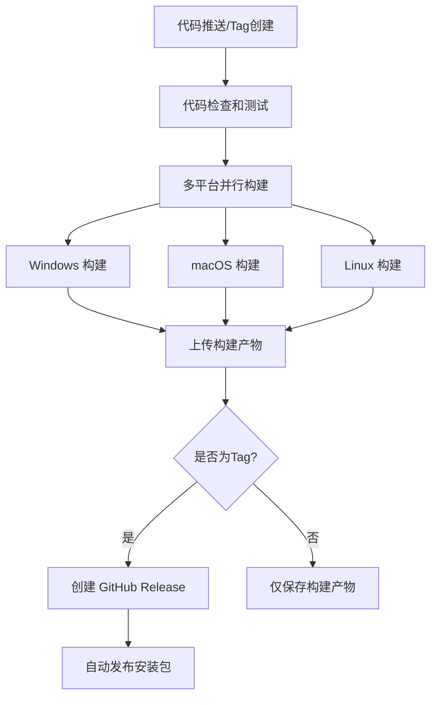

# 构建和发布指南

## 🏗️ GitHub Actions 自动构建

### 触发方式

#### 1. 自动触发
- **推送到 main 分支**: 触发测试构建，验证代码是否能正常构建
- **创建 tag**: 触发完整的构建和发布流程

#### 2. 手动触发
在 GitHub 仓库的 Actions 页面可以手动运行构建流程

### 构建流程



## 📦 支持的平台和格式

### Windows
- **NSIS安装程序** (`.exe`) - 推荐，支持自动更新
- **便携版** (`.exe`) - 免安装，可直接运行
- **架构支持**: x64, x86

### macOS  
- **DMG磁盘映像** (`.dmg`) - 标准macOS安装包
- **ZIP压缩包** (`.zip`) - 便携版本
- **架构支持**: Intel (x64), Apple Silicon (arm64)

### Linux
- **AppImage** (`.AppImage`) - 便携式应用程序，推荐
- **Debian包** (`.deb`) - 适用于Ubuntu/Debian
- **RPM包** (`.rpm`) - 适用于Red Hat/Fedora  
- **压缩包** (`.tar.gz`) - 通用Linux版本
- **架构支持**: x64

## 🚀 发布新版本

### 1. 准备发布
```bash
# 1. 更新版本号
npm version patch  # 小版本更新 (1.0.0 -> 1.0.1)
npm version minor  # 中版本更新 (1.0.0 -> 1.1.0)  
npm version major  # 大版本更新 (1.0.0 -> 2.0.0)

# 2. 推送代码和标签
git push origin main
git push origin --tags
```

### 2. 自动构建和发布
推送 tag 后，GitHub Actions 会自动：
1. 运行代码检查和测试
2. 在三个平台上并行构建应用
3. 创建 GitHub Release
4. 上传所有平台的安装包

### 3. 发布结果
在 GitHub 仓库的 Releases 页面可以看到：
- 📝 自动生成的更新日志
- 📦 各平台的安装包下载链接
- 🔗 完整的变更对比链接

## 🛠️ 本地构建

### 环境要求
```bash
# Node.js 18+
node --version

# pnpm 包管理器
npm install -g pnpm

# 安装依赖
pnpm install
```

### 构建命令
```bash
# 构建当前平台
pnpm run build

# 构建特定平台
pnpm run build:win     # Windows
pnpm run build:mac     # macOS  
pnpm run build:linux   # Linux

# 仅打包不发布
pnpm run dist

# 测试打包（不压缩）
pnpm run pack
```

## ⚙️ 构建配置

### 图标文件
需要在 `build/` 目录下放置图标文件：
- `icon.ico` - Windows图标 (256x256)
- `icon.icns` - macOS图标 (512x512)  
- `icon.png` - Linux图标 (512x512)

### 构建优化
- ✅ **缓存优化**: pnpm store 和 node_modules 缓存
- ✅ **并行构建**: 三个平台同时构建，节省时间
- ✅ **增量构建**: 只有代码变更时才重新构建
- ✅ **依赖过滤**: 排除不必要的文件，减小包体积

### 环境变量
构建过程中使用的环境变量：
- `GH_TOKEN`: GitHub token，用于发布到 Releases
- `CSC_IDENTITY_AUTO_DISCOVERY`: 禁用macOS代码签名
- `ELECTRON_CACHE`: Electron二进制文件缓存路径

## 🔧 故障排除

### 常见问题

#### 1. Windows构建失败
```bash
# 可能需要安装Visual Studio Build Tools
npm install --global windows-build-tools
```

#### 2. macOS公证失败
```yaml
# 在GitHub Actions中禁用公证
env:
  CSC_IDENTITY_AUTO_DISCOVERY: false
```

#### 3. Linux依赖缺失
```bash
# Ubuntu/Debian
sudo apt-get install libnss3-dev libatk-bridge2.0-dev libgtk-3-dev

# CentOS/RHEL  
sudo yum install gtk3-devel nss-devel
```

#### 4. 构建缓存问题
```bash
# 清理本地缓存
pnpm store prune
rm -rf node_modules/.cache
rm -rf dist/
```

### 调试构建
```bash
# 启用详细日志
DEBUG=electron-builder pnpm run build

# 只构建不发布
pnpm run dist

# 检查打包文件
pnpm run pack
ls -la dist/
```

## 📊 构建监控

### GitHub Actions状态
- 🟢 **成功**: 所有平台构建完成，Release已创建
- 🟡 **进行中**: 构建正在进行
- 🔴 **失败**: 构建失败，查看日志排查问题

### 构建时间参考
- **Windows**: ~5-8分钟
- **macOS**: ~6-10分钟  
- **Linux**: ~4-6分钟
- **总时间**: ~15-20分钟（并行）

### 包大小参考
- **Windows**: ~150-200MB
- **macOS**: ~180-230MB
- **Linux**: ~160-210MB

## 🔄 自动更新

### 配置自动更新
```javascript
// 在main.js中添加
const { autoUpdater } = require('electron-updater');

app.whenReady().then(() => {
  // 检查更新
  autoUpdater.checkForUpdatesAndNotify();
});
```

### 更新服务器
- 使用 GitHub Releases 作为更新服务器
- 自动检测新版本并提示用户更新
- 支持增量更新，减少下载大小

---

## 📝 注意事项

1. **首次设置**: 需要更新 `package.json` 中的 GitHub 仓库信息
2. **权限设置**: 确保 GitHub Actions 有写入 Releases 的权限
3. **图标准备**: 准备各平台的应用图标文件
4. **代码签名**: 生产环境建议配置代码签名证书
5. **测试验证**: 发布前在各平台测试安装包是否正常工作